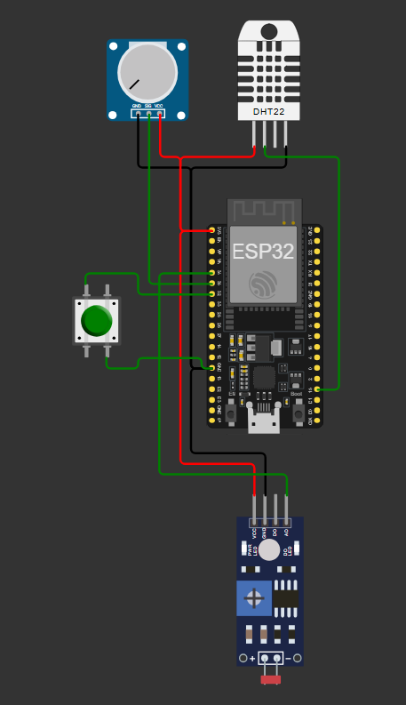

# Estação Meteorológica ESP32

[Link do projeto no Wokwi][1]

## Hardware

* ESP32
* DHT22
* Potênciometro
* Botão
* LDR (sensor de luminosidade)

## Software

### Wokwi

O simulador ESP32 mais avançado do mundo.

### Linguagem de programação C/C++

### HiveMQ

[Broker MQTT público gratuito.][2]

[MQTT websocket client.][3]

[1]: https://wokwi.com/projects/460302591901347841

[2]:https://www.hivemq.com/mqtt/public-mqtt-broker/

[3]: https://www.hivemq.com/demos/websocket-client/
